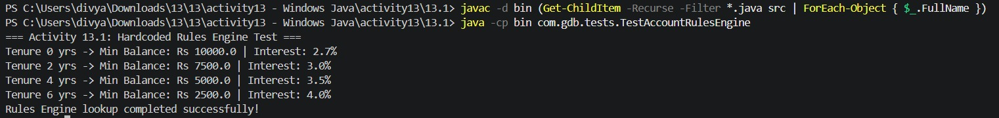

# Activity 13.1: Account Rules Engine

## Objective

Create an `AccountRulesEngine` using in-memory `Map` lookup tables to determine:

- Savings minimum balance
- Savings interest rate
- Current account overdraft limit
- Fixed deposit interest rate

## Tenure-Based Savings Rules

| Tenure | Minimum Balance | Interest |
|---|---:|---:|
| 0 years | Rs 10000.0 | 2.70% |
| 2 years | Rs 7500.0 | 3.00% |
| 4 years | Rs 5000.0 | 3.50% |
| 6 years | Rs 2500.0 | 4.00% |

## Result

Rules Engine lookup completed successfully!
