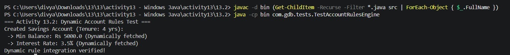

# Activity 13.2: Dynamic Account Rules Integration

## Objective

Connect the account classes with the `AccountRulesEngine` to dynamically assign minimum balance and interest rates based on customer tenure.

## Result

Dynamic rule integration verified successfully!
